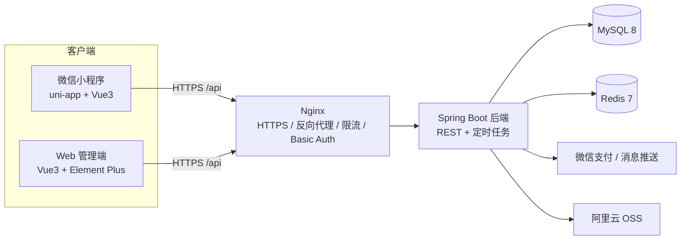

# 乾程锁具生意通（微信小程序 + Web 管理端）

> 面向实体五金店的自用商城系统：用户端微信小程序（浏览、购物车、下单、微信支付、退款、收货）+ 商家 Web 管理后台（SPU/SKU、分类、订单发货、退款审核）。已在自有域名部署上线并实际运行。

## 功能总览

### 用户端（微信小程序 · uni-app + Vue3）
- 商品：分类、搜索、商品详情（SPU + SKU 规格选择）、推荐
- 购物车、收货地址、收藏、浏览足迹
- 下单、微信支付（JSAPI）、订单列表/详情、取消订单、申请退款、确认收货
- 物流方式选择（同城配送 / 到店自提）

### 管理端（Web · Vue3 + Element Plus）
- 商品：SPU、SKU、规格模板/规格项、分类管理
- 订单：列表/详情、发货（对接微信发货管理）、退款审核、订单统计
- 用户管理、物流管理、图片上传、仪表盘

### 后端（Spring Boot）
- JWT 认证与鉴权、统一响应、全局异常处理、接口限流
- 订单状态机（CAS 乐观锁并发控制）
- 退款可靠性：claim-first 先占位再外呼 + 退款回调三态自愈 + 定时对账
- Redis 缓存三防（穿透 / 击穿 / 雪崩）与 SKU 读写分离缓存
- 微信支付 / 退款回调、微信消息推送、OSS 图片存储
- 定时任务：超时取消、自动收货、库存缓存补偿、退款对账

## 技术栈

| 模块 | 技术 |
|------|------|
| 后端 | Spring Boot 3.2 + Java 17 + MyBatis-Plus + JWT |
| 数据库 | MySQL 8.0 |
| 缓存 / 分布式锁 | Redis 7 + Redisson |
| 小程序 | uni-app + Vue3 + uView UI + Pinia |
| 管理端 | Vue3 + Element Plus + Vite + Pinia |
| 外部服务 | 微信支付（JSAPI）、微信消息推送、阿里云 OSS |
| 部署 | Docker + Nginx + GitHub Actions CI/CD |

## 架构图



## 核心亮点

- **订单状态机并发一致性**：以 CAS 乐观锁（条件 UPDATE + affected rows）收敛取消 / 支付回调 / 退款 / 自动收货多路竞态；退款先占位「退款中」再外呼，超时或响应丢失不回滚，由回调与定时对账任务收敛——成功才回补库存，失败落可重试态，区分「确定失败」与「响应丢失」。
- **事务边界与幂等**：下单只读校验移出事务，写操作以 `TransactionTemplate` 编程式事务包裹；支付链路隔离微信 HTTP 外呼，消除长事务连接占用与 `UnexpectedRollbackException`；下单幂等采用 SETNX + 归属校验 + 失败释放。
- **缓存三防**：空值哨兵防穿透、Redisson 互斥锁 + double-check 防击穿、TTL 随机抖动防雪崩，保证热点 key 单请求回源 DB。
- **SKU 读写分离缓存**：高频库存与低频元数据拆分独立 key，写操作分级失效，将库存变更的失效范围收敛至单 key。
- **双端交付与上线运维**：独立完成小程序 / 管理端 / 后端三端，GitHub Actions 自动化测试、构建与部署，Nginx 双域名 HTTPS、ICP 备案、每日数据库备份。

## 目录结构

```
hardware-mall/
├── hardware-mall-backend/     # Spring Boot 后端
├── hardware-mall-admin/       # Vue3 管理端
├── hardware-mall-uniapp/      # uni-app 微信小程序
├── apifox/                    # Apifox 接口测试用例与报告
├── scripts/                   # 部署 / 备份 / 压测 / 数据导入脚本
└── docs/                      # 项目文档
```

## 快速开始

### 1. 依赖服务

启动本机 MySQL 8 与 Redis 7（或将连接地址指向已有实例）。

### 2. 后端

```bash
cd hardware-mall-backend

# 建表 + 初始化管理员/物流基础数据
mysql -u root -p < src/main/resources/db/init.sql

# 在 hardware-mall-backend/ 下创建 .env，填入数据库、Redis、JWT、微信、OSS 等变量
#（变量清单见《部署说明》），.env 不会被提交

mvn spring-boot:run
```

### 3. 管理端

```bash
cd hardware-mall-admin
npm install
npm run dev
```

### 4. 小程序

```bash
cd hardware-mall-uniapp
npm install
npm run dev:mp-weixin   # 或用 HBuilderX 打开项目
```

## 测试

- 后端单元测试：JUnit 5 + Mockito + AssertJ

```bash
cd hardware-mall-backend && mvn test
```

- 接口测试：`apifox/` 下的用例集与测试报告（`apifox/reports/api-test-report.html`）
- 压测：`scripts/loadtest/`（Apache JMeter，下单链路）

## 部署与 CI/CD

- 后端与管理端通过 GitHub Actions 构建为 Docker 镜像并推送至镜像仓库，SSH 部署到服务器
- Nginx 提供双域名 HTTPS 反向代理、限流与后台 Basic Auth 防护
- 小程序构建产物由 Actions 上传体验版
- 详细说明见 [部署说明](./docs/部署说明.md)

## 文档

- [项目背景](./docs/项目背景.md)
- [数据库设计文档](./docs/数据库设计文档.md)
- [接口规范文档](./docs/商城单体项目接口规范文档.md)
- [部署说明](./docs/部署说明.md)

## License

MIT
