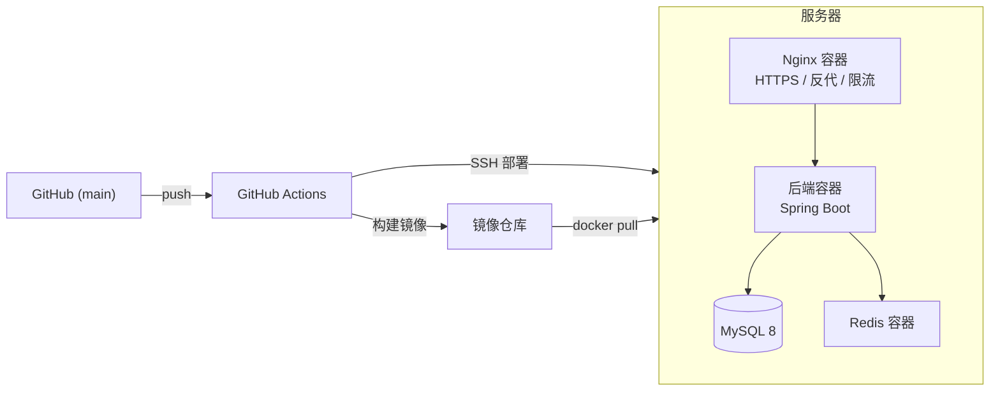

# 部署说明

本文件描述系统的部署形态与 CI/CD 流程，不包含任何服务器地址、域名或凭证。

## 一、部署架构

- **后端**：Spring Boot 以 Docker 镜像运行，连接宿主机 MySQL 与 Redis。
- **管理端**：Nginx 容器托管 Vue3 静态资源，并将 `/api` 反向代理到后端。
- **Redis**：容器运行，仅供后端内网访问。
- **MySQL**：宿主机安装或以容器运行，仅监听本机回环。

## 二、CI/CD 工作流

| 工作流 | 触发 | 作用 |
|--------|------|------|
| `test.yml` | PR / push 到 main | 后端 `mvn test` + 管理端构建 + 小程序构建 |
| `backend-admin-deploy.yml` | push main / 手动 | 构建并推送后端、管理端镜像；SSH 部署并健康检查 |
| `uniapp-experience.yml` | push 改动 `hardware-mall-uniapp/` / 手动 | 构建小程序并上传体验版 |

部署以 **commit sha** 作为镜像 tag，便于按提交回滚。部署脚本只同步编排文件到服务器并拉取镜像重启容器，服务器上的代码仓库状态不代表线上版本，排查问题请以镜像 tag 为准。

## 三、环境变量

后端通过 `.env`（不入库）注入运行时配置，主要变量：

| 分类 | 变量 |
|------|------|
| 数据库 | `DB_HOST` `DB_PORT` `DB_NAME` `DB_USERNAME` `DB_PASSWORD` |
| Redis | `REDIS_HOST` `REDIS_PORT` `REDIS_PASSWORD` |
| 鉴权 | `JWT_SECRET` `JWT_EXPIRATION` `ADMIN_USERNAME` `ADMIN_PASSWORD` |
| 微信 | `WECHAT_APPID` `WECHAT_SECRET` `WECHAT_MCH_ID` `WECHAT_API_V3_KEY` `WECHAT_PRIVATE_KEY` `WECHAT_PUBLIC_KEY` `WECHAT_MCH_SERIAL_NO` `WECHAT_PAY_NOTIFY_URL` |
| OSS | `OSS_ACCESS_KEY_ID` `OSS_ACCESS_KEY_SECRET` `OSS_BUCKET_NAME` `OSS_REGION` `OSS_DOMAIN` |
| 告警 | `DINGTALK_WEBHOOK` `DINGTALK_SECRET` |
| 跨域 | `CORS_ALLOWED_ORIGINS` |

生产环境密钥通过服务器上的 `.env` 与 GitHub Actions Secrets 提供，二者均不进入版本库。

## 四、首次部署

1. 准备服务器：安装 Docker、部署用户加入 docker 组、放行 80/443。
2. 配置 `.env` 真实环境变量与 TLS 证书。
3. 在 GitHub 仓库 Settings → Secrets 配置镜像仓库、服务器 SSH 等密钥。
4. 手动触发 `backend-admin-deploy.yml` 完成首次发布，观察健康检查是否通过。
5. 小程序端在微信后台配置 request 合法域名后发布。

## 五、回滚

镜像 tag 即 commit sha。回滚时在服务器将编排文件中的镜像 tag 指向目标提交并重启对应容器即可。
